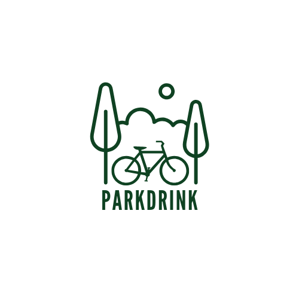

<h1 align="center">
   
  
   
  ParkDrink
   
</h1>

## ParkDrink – Getränkelieferservice per Lastenrad 🚲🥤

Ein nachhaltiger, mobiler Getränkelieferservice für Leipziger Parks – spontan, lokal und bequem per Web-App bestellbar. ParkDrink wurde im Rahmen einer universitären Fallstudie entwickelt und zeigt, wie moderne Webtechnologien zur Lösung urbaner Alltagsprobleme beitragen können.

---

## ✨ Key Features

* 📦 **Live-Bestellung** – Produkte direkt aus dem Park bestellen  
* 📍 **Standortfreigabe & ETA** – Standort teilen und ungefähre Ankunftszeit sehen  
* 🚲 **Live-Tracking** – Verfolge das Lastenrad auf der Karte in Echtzeit  
* 💳 **Sichere Bezahlung via Stripe**  
* 🧭 **Benutzerfreundliches Interface** – optimiert für Smartphone & Sonnenlicht  
* 🌙 **Dark/Light Mode**  
* 🔒 **Datenschutzkonform (DSGVO)** – sichere Authentifizierung und Firestore Rules  
* 🌐 **Cross-Platform** – Web-App funktioniert auf Android, iOS, Windows & macOS

---

## ☁️ Tech Stack

| Bereich        | Technologie      |
|----------------|------------------|
| Frontend       | React (TypeScript) |
| Backend/API    | Firebase Functions (NodeJS) |
| Datenbank      | Firestore (NoSQL) |
| Authentifizierung | Firebase Auth |
| Hosting        | Firebase Hosting |
| Zahlung        | Stripe API |
| Karten/Tracking| Firestore Live-Updates + GPS |

---

## 🤖 Entwicklungshighlights

- 83 % der Entwicklungszeit: Den Fehler gesucht, den ein Semikolon verursacht hat.
- 12 %: Diskussionen über Buttonfarben
- 5 %: Tatsächliches Programmieren

---

## 📦 Download

Zurzeit keine produktive Version verfügbar – MVP im Rahmen einer Hochschul-Fallstudie. 

---

## 🔐 Sicherheitskonzept

- 🔐 **Firestore Security Rules** schützen sensible Daten
- 🧮 **Preisberechnung nur serverseitig**
- 🔁 **Bestellungen via Cloud Function `createOrder()`**
- 🔑 **Nur authentifizierte Nutzer dürfen bestellen**

---

## 🎓 Credits & Lizenzen

Diese App wurde von einem studentischen Team im Rahmen des Kurses *Fallstudie Software-Engineering* entwickelt.

**Open Source Komponenten:**
- [React](https://react.dev/)
- [Firebase](https://firebase.google.com/)
- [Stripe](https://stripe.com/)
- [Leaflet](https://leafletjs.com/)
- [Vite](https://vitejs.dev/) 

---

## 🧠 Du möchtest mitarbeiten?

werde Student/-in an der IU 

---

## 📜 License

MIT License

---
